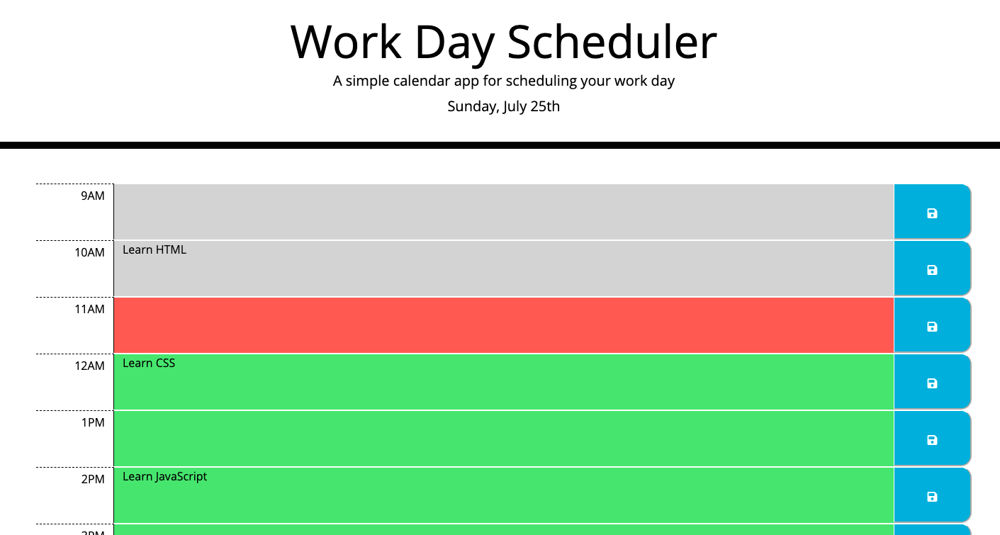

# 5. Third Party APIs Challenge: Work Day Scheduler

## Description

This application is a work day schedule built to schedule events on the hour of any day between the hours of 9:00 AM and 5:00 PM. To add an event, simply click any of the long colored areas in between the hour indication and the save button, type your event's name, and press the save button. The application uses Luxon to keep track of the time, and changes the color of each time block depending on if it is in the past, the current hour, or the future. The events you enter will be saved in local storage, and will persist on the page between sessions.

## Deployment

You can visit the live application [here](https://aidanamato.github.io/work-day-scheduler/).

## Credits

[Starter Code](https://github.com/coding-boot-camp/super-disco)

Third Party API's:

- [Bootstrap](https://getbootstrap.com/)
- [jQuery](https://api.jquery.com/)
- [Luxon](https://moment.github.io/luxon/)
- [Font Awesome](https://fontawesome.com/)
- [Google Fonts](https://fonts.google.com/)

## License

[MIT](./LICENSE.txt)